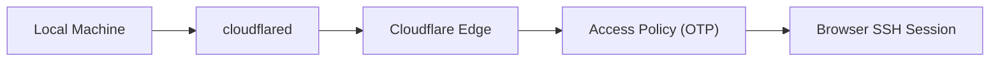
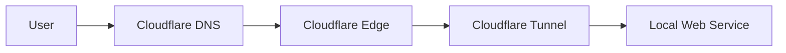

# Notes on Using Cloudflare Tunnel

I’ve been using Cloudflare Tunnel in a few different setups.

One use case is remote development. I run `cloudflared` on my machine and expose SSH through a tunnel. The server establishes an outbound connection to Cloudflare. Access is controlled through Cloudflare Access with OTP.

Cloudflare also provides browser-based SSH. From a phone, including an iPhone, I can open Safari, authenticate, and obtain a terminal session directly in the browser. No separate SSH client is required in that scenario.

## SSH Flow

The local machine maintains the outbound tunnel. Authentication is handled at the edge before a session is established.

## Exposing Web Services

I have also used Cloudflare Tunnel to expose small web services from networks where I do not control public IP configuration. The machine connects outward to Cloudflare, and traffic is routed back through that connection.

This allows a static site or internal tool to be reachable without managing NAT rules or dynamic DNS.

## Replacing Tailscale in Some Cases

For personal use, this has replaced Tailscale in cases where I only need secure access to a single machine or service. Instead of maintaining a private mesh network, access is enforced through Cloudflare’s identity layer.

This is not a universal replacement for private networking, but for individual services it simplifies the setup.

## Potential Kubernetes Pairing

Cloudflare Tunnel can also be paired with Kubernetes. A cluster can sit behind a tunnel, with ingress routed through Cloudflare while pods remain private inside the cluster. The Kubernetes API server and internal services can be placed behind Access policies.

I have not deployed that configuration yet, but the pattern follows the same outbound tunnel model.

## Summary

Cloudflare Tunnel provides:

- Outbound-only connectivity
- Identity-gated access (OTP / Access policies)
- SSH
- DNS and TLS integration at the edge
- A practical way to expose services from constrained networks

For remote access and lightweight hosting, it simplifies infrastructure without requiring direct exposure of the underlying system.
